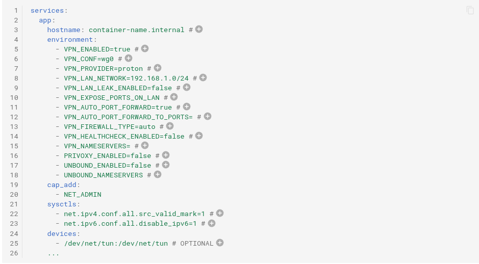

# CasaOS Hotio AppStore

An Appstore containing Hotio Containers from [**Hotio.dev**](https://hotio.dev/)

these are all tested and working...as far as i know.
they have as many icons as i could find for them...
some just didnt have any...

here is a screenshot of the vpn variables for every container.

CasaOS AppStore needs your help to grow:

- See [CONTRIBUTING.md]([CONTRIBUTING.md](https://github.com/IceWhaleTech/CasaOS-AppStore/blob/main/CONTRIBUTING.md)) for how to contribute CasaOS Apps in Docker Compose format.

  **IMPORTANT**: Your PR must be *well tested* on your own CasaOS first. This is the mandatory first step for your submission.

- Check `help wanted` for which issues you can help with.

Thank you!

## 3-Party AppStores

CasaOS allows you to customize your device with a variety of third-party app stores. Below, you'll find a collection of third-party app store links that you can add to your CasaOS device to expand your app selection and enhance your user experience. 

Simply copy the provided source link and add it to your CasaOS settings to access the corresponding app store.

- [Awesome Store list](https://awesome.casaos.io/content/3rd-party-app-stores/list.html)

## Contributors

<!-- ALL-CONTRIBUTORS-LIST:START - Do not remove or modify this section -->
<!-- prettier-ignore-start -->
<!-- markdownlint-disable -->

<!-- markdownlint-restore -->
<!-- prettier-ignore-end -->

<!-- ALL-CONTRIBUTORS-LIST:END -->
